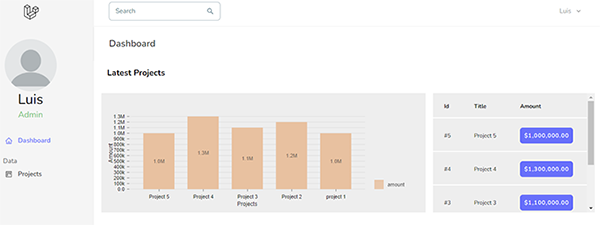

## Real-time Laravel/React App



This is a small app that works using real-time features

* Laravel
* Inertia
* Reactjs
* Websockets
* Pusher
* Nivo Charts
* PHPunit
* Tests
* Code coverage
* Tailwind

## Installation

### Prerequisites

* To run this project, you must have the latest version of php ,also need a pusher.com account and create a channel, you need to add the credentials in the .env file

### Step 1

 Begin by cloning this repository to your machine, and installing all NPM dependencies.

```bash
git clone https://github.com/lupanvi/real-time-laravel-inertia-app
cd real-time-laravel-inertia-app
npm install && npm run dev
```

### Step 2

Install the php dependencies

```bash
composer install
```

### Step 3

create a database and migrate

```bash
php artisan migrate
```

### Step 4

boot up a server

```bash
php artisan serve
```

1. Visit: `http://localhost:8080/register` and register a new user, log in and start creating projects here `http://127.0.0.1:8000/projects/create`
2. Open a new browser, a register a new user and start creating projects 
3. Each time you create a new project in the second browser, you will see in the first browser, in the dashboard, that the new projects are added automatically without refreshing the browser


